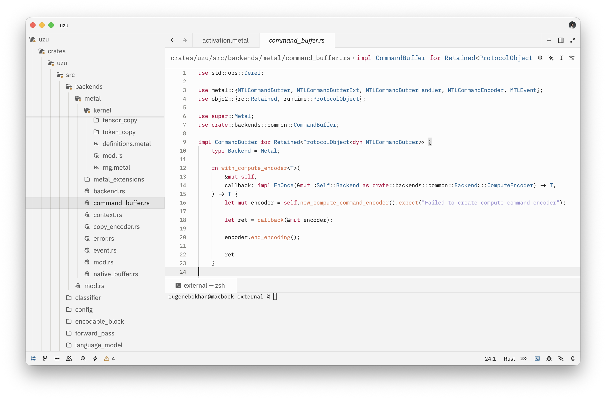
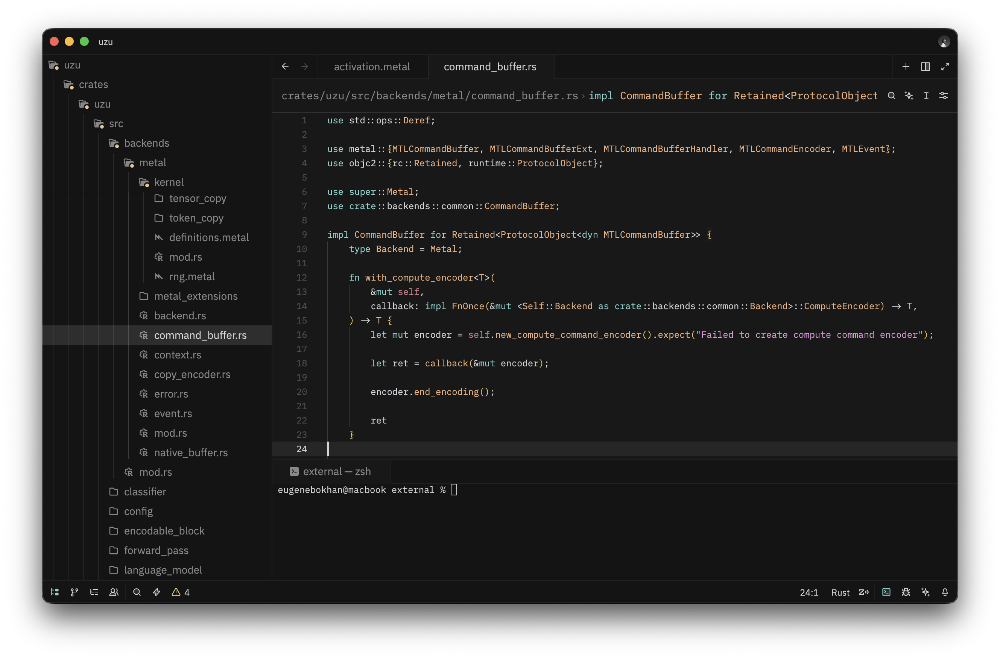

# Cursor Theme for Zed

[](https://zed.dev/extensions/cursor-theme)

Cursor inspired theme for [Zed](https://zed.dev).

## Screenshot

### Light



### Dark



## Usage

Setup auto switch theme in light and dark mode based on the system's appearance.

Open your Zed user settings.json: `~/.config/zed/settings.json`, and add this config:

```json
{
  "theme": {
    "mode": "system",
    "light": "Cursor Light",
    "dark": "Cursor Dark"
  }
}
```

## License

MIT
